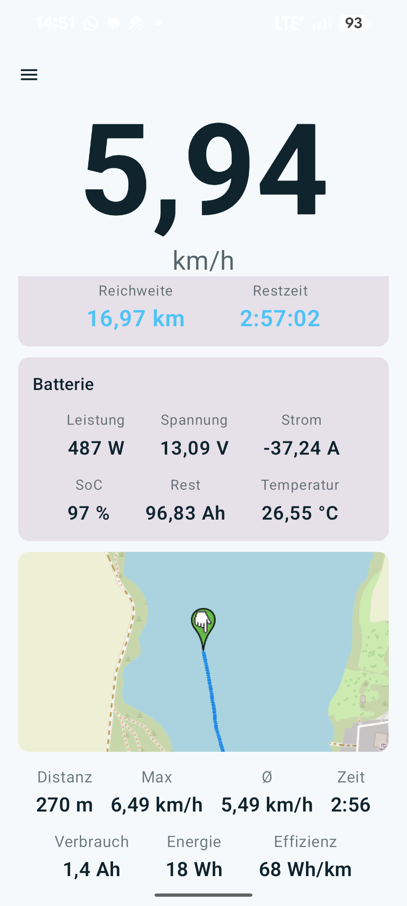
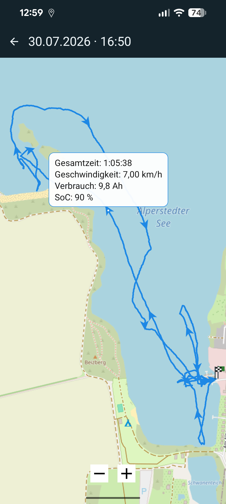
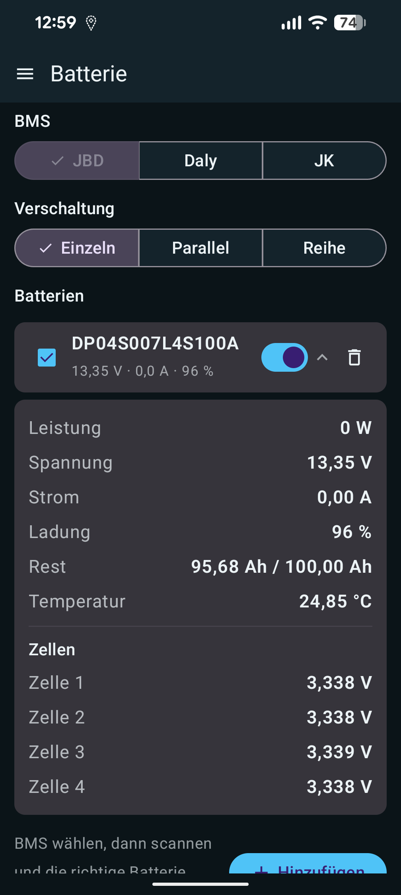
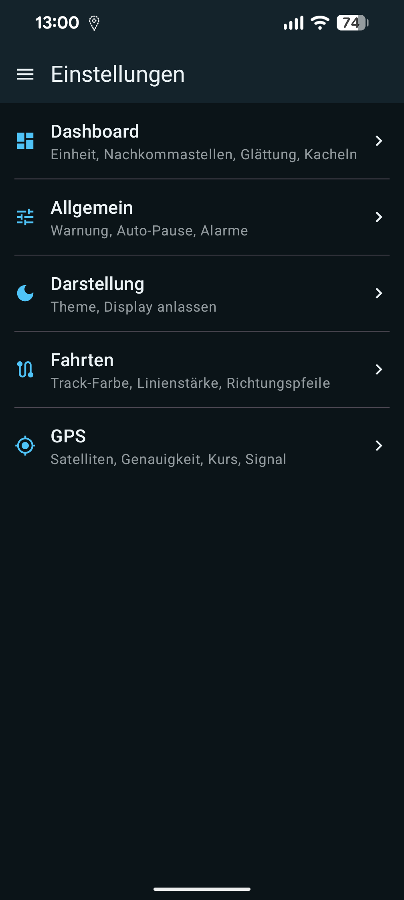

# BoatSpeedy

A **GPS boat speedometer for Android** with **Bluetooth battery analytics and range
estimation** — made for **electric / trolling motors** running on a **Bluetooth (BLE)
battery**. Large, easy-to-read speed readout for low-speed control (~5–10 km/h), live
battery data, and an estimate of how far and how long you can still go.

[](https://github.com/Glenn-Dandy/BoatSpeedy/actions/workflows/build.yml)


🇬🇧 **English** · [🇩🇪 Deutsch](#-deutsch)

---

## Screenshots

<p align="center">
  
  
  
  
</p>

## What it's for

Electric boats and kayaks with a trolling motor usually run on a LiFePO4 pack whose
BMS talks Bluetooth. BoatSpeedy pairs a **precise GPS speedometer** with that battery
so you can, on the water, see **how fast you're going, how much power you're drawing,
and how far you can still get** — all on one screen.

## Features

### Speed & trip
- **Dashboard** with a large speed readout as the main tile
- **Switchable unit**: km/h ↔ knots, configurable decimals (`xx` / `xx.x` / `xx.xx`)
- **Start/Stop trip** via a foreground service — keeps measuring with the screen off
  or the app in the background (persistent notification)
- **Trip distance** and **session stats** (max, average, elapsed); values stay after stop
- **Satellite & GPS status** (satellites used/visible, accuracy, fix), **smoothing** of
  the raw GPS value (important at slow speeds)

### Battery analytics (Bluetooth LE)
- **Multiple batteries**: add packs, keep several **connected at the same time**, mark
  which ones are **active**
- **Wiring mode** — **Single / Parallel / Series** — decides how active packs are
  combined: parallel/single sum up capacity & current, series sums up voltage
- **Live values**: voltage, current, state of charge, remaining Ah, temperature
- **Range & remaining time** at the current speed, **time-averaged** (Off / 15 s /
  30 s / 60 s) so it doesn't jitter with the motor load
- **Dashboard tiles** for battery and range (always visible, or hidden in Settings),
  plus a subtle **A · B · Σ** selector to view a single pack or the combined bank
- **BMS support**: **JBD / Jiabaida** and **Redodo / LiTime / Power Queen** (both verified
  on hardware), **Daly** and **JK / Jikong** (experimental). The BMS type is stored per
  battery, so different packs can be mixed in one bank
- **Wear**: charge cycles, and total discharged Ah where the BMS reports it

### Trips, maps & weather
- **Trip history**: saved trips with distance, moving/total/pause time, consumption (Ah),
  energy (Wh) and Wh/km; a **track map** with direction arrows and start/finish markers —
  tap the track for a speed / consumption / SoC bubble
- **GPX**: export trips and **import** GPX (import button, or “Open with” from other apps)
- **Live map** (OpenStreetMap) that follows your position, with a **DWD rain radar** overlay
  (RADOLAN-RV nowcast, animated now → +100 min, with a slider) and optional **lightning**
- **DWD weather warnings** (thunderstorm / storm) checked on GPS fix and during a trip —
  notification, optional alarm sound and a dashboard banner
- **Anchor watch**: drop an anchor at your position, get alerted if the boat drags

### Charging & alarms
- **Charging mode**: detects charging (positive current) → GPS off, the range tile becomes
  a **charge tile** (time-to-full / done-at), an ongoing charge notification with SoC, a
  **battery-full** alert and a configurable **charge-level** alert
- **Low-charge warning** (red + optional sound) and **auto-pause** below a current threshold
- Bundled **alarm tones** (beep / bell / siren), selectable per alarm (anchor / SoC / weather)

### App
- **Light / dark theme** (Light / Dark / System), optional **keep screen on**
- **Bilingual**: English (default) and German, switchable in Settings
- **About screen** with in-app update check and a **Data & maps** section crediting
  OpenStreetMap and the Deutscher Wetterdienst (DWD, CC BY 4.0)

## Status & untested features

BoatSpeedy is developed and hardware-verified against an **EcoWorthy LiFePO4 100 Ah**
(JBD BMS). Some paths are implemented but **not yet verified on real hardware** — use
with a critical eye and please report back:

| Area | Status |
|---|---|
| GPS speed, trip, stats | ✅ working |
| JBD battery link, live values | ✅ verified on hardware |
| JBD current sign & range/time math | ✅ field-tested (negative = discharge) |
| **Redodo / LiTime / Power Queen** | ✅ verified on hardware, current sign included |
| **Daly BMS** | ⚠️ experimental — UUIDs/offsets from public docs, **untested** |
| **JK / Jikong BMS** | ⚠️ experimental — esp. JK02 offsets/SOC, **untested** |
| **Series / parallel combination** of multiple packs | ⚠️ **untested** on a real multi-pack setup |

## Roadmap / TODO

- [ ] Verify **series / parallel** combination on a real multi-battery setup
- [ ] Calibrate **Daly** and **JK** against real hardware (UUIDs/offsets) — the built-in
      **BLE diagnostic** produces the report needed for this
- [ ] **F-Droid**: drop Google Play Services (use `LocationManager`) to become fully FOSS
- [ ] **Play Store**: App Bundle (`.aab`), privacy policy, data-safety declaration

See [`TODO.md`](TODO.md) for the full list, and [`CHANGELOG.md`](CHANGELOG.md) for changes.

## Install

The app isn't on the Play Store, so you install the signed APK directly (sideload).
Anyone can do it — just follow these steps on an Android 13+ phone:

1. Open the [latest release](https://github.com/Glenn-Dandy/BoatSpeedy/releases/latest)
   and download **`BoatSpeedy-…-release.apk`** (under **Assets**).
2. Open the downloaded file. If Android asks, **allow installing from this source /
   unknown apps** for your browser or file manager.
3. **Play Protect** may then say *“Unsafe app blocked”* / *“App blocked to protect your
   device”*. This is normal for apps outside the Play Store — tap **More details**, then
   **Install anyway**.
4. Open the app and grant the **Location** permission (for GPS speed). Allow **Bluetooth**
   the first time you scan for a battery, and **Notifications** for trip / anchor alerts.

To update later, just install a newer release APK over the old one — same signing key,
your settings are kept.

## Build

Requires a recent Android Studio or JDK 17+ and the Android SDK.

```bash
./gradlew assembleDebug      # debug APK
./gradlew assembleRelease    # signed release APK (needs keystore.properties)
```

The APK is written to `app/build/outputs/apk/`.

## Tech

| | |
|---|---|
| Language | Kotlin |
| UI | Jetpack Compose (Material 3) |
| minSdk / targetSdk | 33 (Android 13) / 35 (Android 15) |
| Speed / satellites | AOSP `LocationManager` (GPS) / `GnssStatus.Callback` — **no Google Play Services** |
| Battery | Bluetooth LE (`BluetoothGatt`), per-device connections |
| Background trip | Foreground service (`foregroundServiceType=location`) |
| Settings | Jetpack DataStore |
| Architecture | MVVM (ViewModel + StateFlow) |

## Permissions

- `ACCESS_FINE_LOCATION` – precise GPS for speed & satellites
- `FOREGROUND_SERVICE`, `FOREGROUND_SERVICE_LOCATION` – keep measuring during a trip
- `POST_NOTIFICATIONS` – trip / anchor / weather / charging notifications (Android 13+)
- `INTERNET`, `ACCESS_NETWORK_STATE` – map tiles, DWD weather warnings & rain radar, update check
- `BLUETOOTH_SCAN` (neverForLocation), `BLUETOOTH_CONNECT` – battery link (BLE)

No `ACCESS_BACKGROUND_LOCATION` (the service starts from the foreground).

Data sources: maps © OpenStreetMap contributors; weather warnings, rain radar and lightning
by the Deutscher Wetterdienst (DWD), licensed CC BY 4.0 (warnings via Bright Sky).

## License

MIT – see [LICENSE](LICENSE).

---

## 🇩🇪 Deutsch

[🇬🇧 English](#boatspeedy) · **Deutsch**

Ein **GPS-Boots-Tacho für Android** mit **Bluetooth-Batterie-Auswertung und
Reichweiten­berechnung** — gemacht für **Elektro- / Trolling-Motoren** mit einer
**Bluetooth-Batterie (BLE)**. Große, gut ablesbare Geschwindigkeitsanzeige für die
Kontrolle im langsamen Bereich (~5–10 km/h), Live-Batteriedaten und eine Schätzung,
**wie weit und wie lange** du noch fahren kannst.

### Wofür

E-Boote und Kajaks mit Trolling-Motor laufen meist auf einem LiFePO4-Akku, dessen BMS
per Bluetooth funkt. BoatSpeedy verbindet einen **präzisen GPS-Tacho** mit diesem Akku,
sodass du auf dem Wasser **Tempo, Stromverbrauch und Restreichweite** auf einem Bild
siehst.

### Funktionen

**Tempo & Fahrt**
- **Dashboard** mit großer Geschwindigkeit als Haupt-Kachel
- **Einheit umschaltbar** km/h ↔ Knoten, Nachkommastellen `xx` / `xx.x` / `xx.xx`
- **Fahrt Start/Stopp** über Vordergrunddienst — misst auch bei ausgeschaltetem Display
  oder im Hintergrund weiter (dauerhafte Benachrichtigung)
- **Trip-Distanz** und **Session-Statistik** (Max, Ø, Zeit); bleiben nach dem Stopp stehen
- **Satelliten-/GPS-Status** und **Glättung** des rohen GPS-Werts (wichtig bei langsamer Fahrt)

**Batterie-Auswertung (Bluetooth LE)**
- **Mehrere Batterien**: Akkus hinzufügen, mehrere **gleichzeitig verbunden**, per
  Häkchen **aktiv** schalten
- **Verschaltung** — **Einzeln / Parallel / Reihe** — bestimmt die Zusammenrechnung:
  parallel/einzeln addieren Kapazität & Strom, Reihe addiert die Spannung
- **Live-Werte**: Spannung, Strom, Ladezustand, Rest-Ah, Temperatur
- **Reichweite & Restzeit** bei aktueller Geschwindigkeit, **zeitlich gemittelt**
  (Aus / 15 s / 30 s / 60 s), damit nichts mit der Motorlast zappelt
- **Dashboard-Kacheln** für Batterie und Reichweite (immer sichtbar oder ausblendbar),
  dazu ein dezenter **A · B · Σ**-Umschalter (einzeln oder kombiniert)
- **BMS-Unterstützung**: **JBD / Jiabaida** und **Redodo / LiTime / Power Queen** (beide
  an Hardware verifiziert), **Daly** und **JK / Jikong** (experimentell). Der BMS-Typ hängt
  an der einzelnen Batterie, gemischte Bänke sind also möglich
- **Verschleiß**: Ladezyklen und, wo das BMS es liefert, insgesamt entnommene Amperestunden

**Fahrten, Karten & Wetter**
- **Fahrten-Historie**: gespeicherte Fahrten mit Distanz, Fahr-/Gesamt-/Pausenzeit,
  Verbrauch (Ah), Energie (Wh) und Wh/km; **Track-Karte** mit Richtungspfeilen und
  Start-/Ziel-Marker — Track antippen zeigt Tempo / Verbrauch / SoC an der Stelle
- **GPX**: Fahrten exportieren und **importieren** (Import-Knopf oder „Öffnen mit")
- **Live-Karte** (OpenStreetMap), folgt der Position, mit **DWD-Regenradar**-Overlay
  (RADOLAN-RV Nowcast, animiert jetzt → +100 Min, mit Schieberegler) und optional **Blitzen**
- **DWD-Wetterwarnungen** (Gewitter / Sturm) — Prüfung bei GPS-Fix und während der Fahrt,
  Benachrichtigung, optionaler Alarmton und Dashboard-Banner
- **Anker-Wache**: Anker an der Position setzen, Alarm bei Abdrift

**Laden & Alarme**
- **Lademodus**: erkennt Laden (positiver Strom) → GPS aus, die Reichweiten-Kachel wird zur
  **Lade-Kachel** („Voll in" / „Fertig um"), laufende Lade-Meldung mit SoC, **„Batterie
  voll"** sowie individuelle Meldung bei einstellbarem **Ladestand**
- **Warnung bei niedrigem Ladestand** (rot + optional Ton), **Auto-Pause** unter einem Strom-Schwellwert
- Mitgelieferte **Alarmtöne** (Piep / Glocke / Sirene), je Alarm wählbar (Anker / SoC / Wetter)

**App**
- **Hell / Dunkel** (Hell / Dunkel / System), optional **Display anlassen**
- **Zweisprachig**: Englisch (Standard) und Deutsch, umschaltbar in den Einstellungen
- **„Über"-Screen** mit In-App-Update-Prüfung und Abschnitt **„Daten & Karten"**
  (OpenStreetMap, Deutscher Wetterdienst — DWD, CC BY 4.0)

### Status & ungetestete Funktionen

Entwickelt und an einer **EcoWorthy LiFePO4 100 Ah** (JBD-BMS) verifiziert. Manches ist
umgesetzt, aber **noch nicht an echter Hardware geprüft** — bitte mit Vorsicht nutzen
und Rückmeldung geben:

| Bereich | Status |
|---|---|
| GPS-Tempo, Fahrt, Statistik | ✅ funktioniert |
| JBD-Anbindung, Live-Werte | ✅ an Hardware verifiziert |
| JBD Strom-Vorzeichen & Reichweiten-/Zeitrechnung | ✅ im Feldtest bestätigt (negativ = Entladen) |
| **Redodo / LiTime / Power Queen** | ✅ an Hardware verifiziert, samt Strom-Vorzeichen |
| **Daly-BMS** | ⚠️ experimentell — UUIDs/Offsets aus Doku, **ungetestet** |
| **JK / Jikong-BMS** | ⚠️ experimentell — v. a. JK02-Offsets/SOC, **ungetestet** |
| **Reihen-/Parallel-Kombination** mehrerer Akkus | ⚠️ **ungetestet** an echtem Mehr-Akku-Aufbau |

### Roadmap / TODO

- [ ] **Reihen-/Parallel**-Kombination an echtem Mehr-Akku-Aufbau prüfen
- [ ] **Daly** und **JK** an echter Hardware kalibrieren (UUIDs/Offsets) — die eingebaute
      **BLE-Diagnose** liefert den dafür nötigen Bericht
- [ ] **F-Droid**: Google Play Services entfernen (`LocationManager`) → vollständig FOSS
- [ ] **Play Store**: App-Bundle (`.aab`), Datenschutzerklärung, Data-Safety-Angaben

Vollständige Liste in [`TODO.md`](TODO.md), Änderungen in [`CHANGELOG.md`](CHANGELOG.md).

### Installieren

Die App ist nicht im Play Store — du installierst die signierte APK direkt (Sideload).
Das kann jeder, so geht's auf einem Android-13+-Handy:

1. Das [neueste Release](https://github.com/Glenn-Dandy/BoatSpeedy/releases/latest) öffnen
   und **`BoatSpeedy-…-release.apk`** herunterladen (unter **Assets**).
2. Die geladene Datei öffnen. Fragt Android nach, die **Installation aus dieser Quelle /
   unbekannte Apps** für den Browser bzw. Dateimanager erlauben.
3. **Play Protect** meldet danach evtl. *„Unsichere App blockiert"* / *„App zum Schutz
   deines Geräts blockiert"*. Das ist bei Apps außerhalb des Play Stores normal — auf
   **Weitere Details** und dann **Trotzdem installieren** tippen.
4. App öffnen und die **Standort**-Berechtigung erteilen (für GPS-Tempo). Beim ersten
   Batterie-Scan **Bluetooth** erlauben, für Fahrt-/Anker-Meldungen **Benachrichtigungen**.

Zum Aktualisieren einfach eine neuere Release-APK über die alte installieren — gleiche
Signatur, deine Einstellungen bleiben erhalten.

### Bauen

```bash
./gradlew assembleDebug      # Debug-APK
./gradlew assembleRelease    # signierte Release-APK (braucht keystore.properties)
```

### Lizenz

MIT – siehe [LICENSE](LICENSE).
