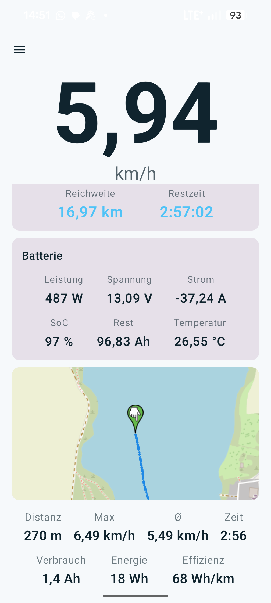
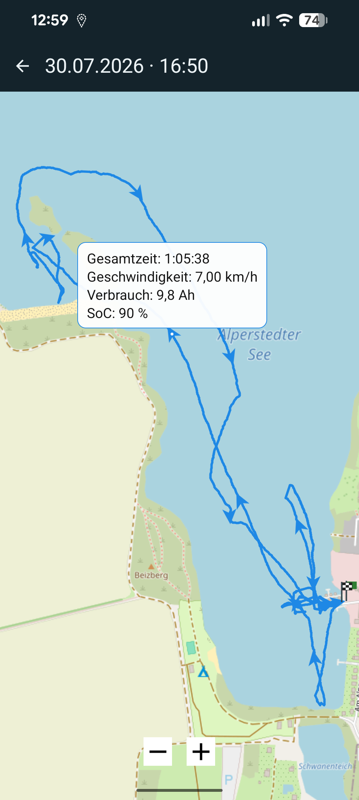
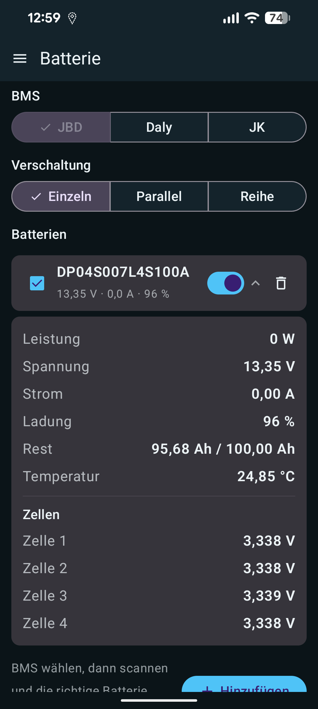
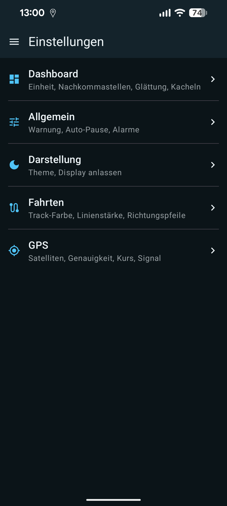

# BoatSpeedy

**GPS-Bootstacho und Navigation für kleine Boote.** Mit Motor, mit Paddel, mit Riemen.
Routen entlang der Wasserwege, im Kanu auch ums Wehr herum. Mit Bluetooth-BMS oder
Coulometer am Akku kommen Live-Werte und Reichweite dazu.

[](https://github.com/Glenn-Dandy/BoatSpeedy/actions/workflows/build.yml)


🇬🇧 [English](#english) · 🇩🇪 **Deutsch**

<p align="center">
  
  
  
  
</p>

## Wofür

Ohne Akku fehlt nur die Batteriekachel, alles andere braucht nur das Handy. Das Fahrzeug
steht auf Motorboot oder Kanu, danach richten sich die Verbote: `boat=no` sperrt das
Motorboot, fürs Kanu ist es ein Hinweis. Auf der oberen Saale sind das 44 km am Stück.

## Navigation

Langer Druck auf die Karte setzt ein Ziel. Zur Wahl stehen Luftlinie oder **Route entlang
der Wasserwege**, jeweils mit Entfernung und geschätztem Verbrauch in Amperestunden. Ein
Kurspfeil zeigt, wie weit zu drehen ist.

**Kartendaten.** Die Wasserwege liegen als Kacheln auf dem Gerät, ein Grad breit und hoch.
Ganz Europa sind 1376 Kacheln und 176 MB; ein Umkreis von 150 km rund 20 Kacheln und
3,4 MB. Daraus rechnet das Handy die Route selbst, bis 600 km Zielentfernung. Ohne Kacheln
geht es über die Overpass-Schnittstelle, bis 60 km. Fehlende und veraltete Kacheln bietet
die App vor einer Route an. Die Karte darunter kommt von OpenStreetMap und braucht Netz.
Der Kartenserver lässt sich unter Navigation, Kartendaten wechseln.

Erzeugt werden die Kacheln aus OpenStreetMap über Geofabrik, siehe
[boatspeedy-mapdata](https://github.com/Glenn-Dandy/boatspeedy-mapdata).

**Fahrzeug.** Motorboot oder Kanu entscheidet, welche Verbote gelten. Die Zugangsmerkmale
werden gestuft gelesen, wie OSM sie meint: `access` gilt für alles, `boat` für Boote,
`motorboat` und `canoe` für die einzelne Art, und das Genauere schlägt das Allgemeinere.
`boat=no` plus `canoe=yes` heißt also "Boote nein, Kanu ja".

Fürs Kanu ist ein nacktes `boat=no` kein Ausschluss, sondern ein Hinweis: Auf der oberen
Saale tragen 44 km am Stück dieses Merkmal, gemeint gegen Motoren. Solche Abschnitte
kosten bei der Wegsuche das Dreifache, damit der freie Weg gewinnt, wo es einen gibt, und
werden rot gezeichnet, wo es keinen gibt.

**Auf dem Weg.** Schleusen, Wehre und Brücken mit Durchfahrtshöhe stehen ab Zoomstufe 11
auf der Karte, auch ohne Route. Eine Schleuse antippen zeigt Öffnungszeiten, Telefon,
Funkkanal und Kammermaß, so wie OpenStreetMap sie führt; das Symbol sitzt in der Mitte der
Kammer, bei Doppelschleusen je Kammer eines. Ein- und Ausstiege und Slipanlagen folgen ab
Zoomstufe 13, Wasserkraftanlagen haben ein eigenes Symbol. Seezeichen sind antippbar,
Geschwindigkeitsschilder zeigen ihren Wert. Winkel auf den Flüssen zeigen die
Fließrichtung, unten links steht, wie viel der Route flussauf und flussab geht.

**Wehre und Umtragen.** Ein Wehr sperrt die Route nicht, es kostet: Jede Schleuse und jede
Umtragung gewinnt dagegen, und wo es nichts gibt, führt die Strecke hindurch und sagt es.
Im Kanu geht die Route ums Wehr herum, über die Umtragewege aus OpenStreetMap oder von
Anleger zu Anleger, grün gestrichelt und mit Metern unten links. Durch Wasserkraftanlagen
führt sie nie, und im Kanu zieht sie den Fluss dem Mühl- oder Kraftwerkskanal vor.
Eingetragene Umtragewege gehen vor. Jedes Wehr zählt einmal, wenn die Strecke hindurch
führt oder daran vorbeiträgt; nur daneben vorbeifahren zählt nicht.

**Routen speichern und nachfahren.** Eine gerechnete Route lässt sich mit Namen speichern,
teilen und später nachfahren, ebenso eine aufgezeichnete Fahrt. Eine gestrichelte Linie
führt vom Boot zum Start, danach geht es der Strecke nach.

**Karte.** Norden oben oder Fahrtrichtung oben, umschaltbar in der Titelzeile. Marker und
Karte gleiten wie bei einem Navigationsgerät: Aus Fahrt und Kurs wird fortlaufend
gerechnet, wo das Boot jetzt ist, statt von Messung zu Messung zu springen. Nur für die
Anzeige, die aufgezeichnete Fahrt bleibt bei den rohen Messwerten.

## Tempo und Fahrt

- Dashboard mit großer Geschwindigkeit als Hauptkachel; die übrigen Kacheln lassen sich
  anordnen und ausblenden, die Karte in vier Größen ziehen
- Einheit km/h oder Knoten, Nachkommastellen `xx`, `xx.x`, `xx.xx`
- Start und Stopp über einen Vordergrunddienst, misst bei ausgeschaltetem Display weiter
- Trip-Distanz und Statistik (Max, Mittel, Zeit), bleiben nach dem Stopp stehen
- Satelliten- und GPS-Status, Glättung des rohen Werts (wichtig bei langsamer Fahrt)
- Auto-Pause: pausiert nur bei wenig Strom **und** Stillstand, Treiben wird weiter erfasst

## Batterie (Bluetooth LE)

- Mehrere Akkus gleichzeitig verbunden, per Häkchen aktiv geschaltet
- Verschaltung Einzeln, Parallel oder Reihe bestimmt die Zusammenrechnung
- Live: Spannung, Strom, Ladezustand, Rest-Ah, Temperatur
- Reichweite und Restzeit beim aktuellen Tempo, zeitlich gemittelt (aus, 15, 30, 60 s)
- Verschleiß: Ladezyklen und insgesamt entnommene Amperestunden, wo das BMS sie liefert
- Lademodus: erkennt Laden, schaltet GPS ab, zeigt "Voll in" und meldet bei frei
  wählbarem Ladestand
- BMS: JBD/Jiabaida und Redodo/LiTime/Power Queen an Hardware geprüft, Daly und JK/Jikong
  experimentell. Der Typ hängt an der einzelnen Batterie, gemischte Bänke sind möglich
- **Coulometer mit Hall-Sensor** für Akkus ohne eigenes Bluetooth: Spannung, Strom,
  Ladestand, Rest-Ah und gezählte Energie. Strom nullen, auf voll setzen, Zähler löschen

## Fahrten und Wetter

- Fahrtenhistorie mit Distanz, Fahr-, Gesamt- und Pausenzeit, Ah, Wh und Wh/km
- Track-Karte mit Richtungspfeilen; Track antippen zeigt Tempo, Verbrauch, SoC, Strom und
  Leistung
- Fahrten und Routen benennen, GPX exportieren und importieren
- Wetteransicht: DWD-Regenradar (RADOLAN-RV, animiert bis +100 min), Messwerte der
  nächsten Station und die Windrichtung als Pfeil
- DWD-Wetterwarnungen bei Gewitter und Sturm, mit Benachrichtigung und Banner
- Ankerwache mit Alarm bei Abdrift

## Stand

Entwickelt und geprüft an einer EcoWorthy LiFePO4 100 Ah mit JBD-BMS.

| Bereich | Stand |
|---|---|
| GPS-Tempo, Fahrt, Statistik | ✅ läuft |
| JBD, Redodo/LiTime/Power Queen | ✅ an Hardware geprüft |
| Coulometer mit Hall-Sensor | ✅ an Hardware geprüft |
| Routing, Kacheln, Schleusen | ✅ im Feld geprüft (Saale, Rhein, Main) |
| Umtragen, Wasserkraftanlagen | ✅ geprüft an der Saale |
| Daly-BMS | ⚠️ experimentell, UUIDs aus Doku, ungetestet |
| JK/Jikong-BMS | ⚠️ experimentell, v. a. JK02-Offsets, ungetestet |
| Reihe und Parallel mehrerer Akkus | ⚠️ ungetestet an echtem Aufbau |

Die Routenqualität hängt an OpenStreetMap. Tiefen stehen dort nicht, Durchfahrtshöhen nur
an manchen Brücken; die Route ist ein Vorschlag, kein Fahrwasser.

## Offen

- [ ] Reihe und Parallel an echtem Mehr-Akku-Aufbau prüfen
- [ ] Daly und JK an Hardware kalibrieren, die eingebaute BLE-Diagnose liefert den Bericht

Vollständig in [`TODO.md`](TODO.md), Änderungen in [`CHANGELOG.md`](CHANGELOG.md).

## Installieren

Am einfachsten über [F-Droid](https://f-droid.org/packages/de.kewl.boatspeedy/), dort kommen
auch die Aktualisierungen. F-Droid liefert dieselbe signierte APK wie GitHub, beide lassen
sich übereinander installieren.

Oder direkt von GitHub:

1. [Neuestes Release](https://github.com/Glenn-Dandy/BoatSpeedy/releases/latest) öffnen,
   `BoatSpeedy-…-release.apk` unter **Assets** laden.
2. Datei öffnen und die Installation aus dieser Quelle erlauben.
3. Meldet Play Protect "Unsichere App blockiert", auf **Weitere Details** und
   **Trotzdem installieren** tippen. Das ist außerhalb des Play Stores normal.
4. Standort erlauben (GPS-Tempo), beim ersten Batteriescan Bluetooth, für Meldungen
   Benachrichtigungen.

Aktualisieren: neuere APK über die alte installieren. Gleiche Signatur, Einstellungen
bleiben.

## Bauen

Braucht JDK 17 und das Android SDK.

```bash
./gradlew assembleDebug      # Debug-APK
./gradlew assembleRelease    # signierte Release-APK, braucht keystore.properties
./gradlew test               # 184 Unit-Tests
```

Ergebnis in `app/build/outputs/apk/`. Die Bauten sind reproduzierbar: kein `vcsInfo`,
keine `dependenciesInfo`.

## Technik

| | |
|---|---|
| Sprache | Kotlin |
| Oberfläche | Jetpack Compose, Material 3 |
| minSdk / targetSdk | 33 (Android 13) / 35 (Android 15) |
| Tempo und Satelliten | AOSP `LocationManager`, `GnssStatus.Callback`, keine Google Play Services |
| Karte | osmdroid, OpenStreetMap |
| Routing | Dijkstra über eigene Kacheln, Overpass als Rückfallebene |
| Batterie | Bluetooth LE (`BluetoothGatt`), Verbindung je Gerät |
| Fahrt im Hintergrund | Vordergrunddienst (`foregroundServiceType=location`) |
| Einstellungen | Jetpack DataStore |
| Aufbau | MVVM mit ViewModel und StateFlow |

## Berechtigungen

| | |
|---|---|
| `ACCESS_FINE_LOCATION`, `ACCESS_COARSE_LOCATION` | GPS für Tempo und Satelliten; seit Android 12 werden beide zusammen angefragt |
| `FOREGROUND_SERVICE`, `…_LOCATION` | Messen während der Fahrt |
| `POST_NOTIFICATIONS` | Fahrt, Anker, Wetter, Laden (ab Android 13) |
| `INTERNET`, `ACCESS_NETWORK_STATE` | Kartenkacheln, Wetter, Kartendaten, Update-Prüfung |
| `BLUETOOTH_SCAN` (neverForLocation), `BLUETOOTH_CONNECT` | Batterie |

Kein `ACCESS_BACKGROUND_LOCATION`, der Dienst startet aus dem Vordergrund.

Datenquellen: Karten und Wasserwege © OpenStreetMap-Mitwirkende (ODbL), Seezeichen
OpenSeaMap (CC BY-SA), Regenradar, Blitze und Warnungen vom Deutschen Wetterdienst
(CC BY 4.0, Warnungen über Bright Sky).

## Lizenz

MIT, siehe [LICENSE](LICENSE).

---

## English

🇬🇧 **English** · [🇩🇪 Deutsch](#boatspeedy)

**GPS boat speedometer and navigation for small boats.** Under motor, paddle or oars.
Routes along the waterways, around the weir by canoe. A Bluetooth BMS or a
coulometer on the pack adds live values and range.

### What it is for

Without a battery you only lose the battery tile, the rest needs nothing but the phone.
The craft is motorboat or canoe, and the bans follow from it: `boat=no` stops a
motorboat, for a canoe it is a hint. On the upper Saale that is 44 km in one stretch.

### Navigation

A long press on the map sets a destination, as a straight line or a **route along the
waterways**, each with distance and estimated amp hours. A course arrow shows how far to
turn.

**Map data.** The waterways sit on the device as tiles, one degree wide and tall. All of
Europe is 1376 tiles and 176 MB; a 150 km radius about 20 tiles and 3.4 MB. The phone
computes the route from them itself, up to 600 km. Without tiles it uses the Overpass API,
up to 60 km. Missing and outdated tiles are offered before a route is computed. The map
underneath comes from OpenStreetMap and needs a connection. The map server can be changed
under Navigation, Map data.

The tiles are built from OpenStreetMap via Geofabrik, see
[boatspeedy-mapdata](https://github.com/Glenn-Dandy/boatspeedy-mapdata).

**Craft.** Motorboat or canoe decides which bans apply. Access tags are read as the
graded set they are: `access` covers everything, `boat` covers boats, `motorboat` and
`canoe` the single kind, and the more specific one wins. So `boat=no` plus `canoe=yes`
means "no boats, canoes yes".

For a canoe a bare `boat=no` is a hint rather than a stop: on the upper Saale 44 km carry
it in one stretch, aimed at engines. Such sections cost triple when routes are compared,
so a free way wins where one exists, and they are drawn in red where none does.

**Along the way.** Locks, weirs and bridges with a clearance height appear on the map from
zoom 11, with no route set. Tapping a lock shows opening hours, phone number, VHF channel
and chamber size as OpenStreetMap records them; the symbol sits in the middle of the
chamber, one per chamber on double locks. Put-ins, egress points and slipways follow from
zoom 13, hydro power plants have their own symbol. Seamarks are tappable, speed signs show
their number. Chevrons on rivers show the flow, and the box at the bottom left says how
much of the route runs upstream and downstream.

**Weirs and portage.** A weir does not block the route, it costs: every lock and every
portage wins against it, and where there is nothing, the route goes through and says so.
In a canoe the route goes around the weir, along the portage paths from OpenStreetMap or
from landing to landing, green dashed and with the metres at the bottom left. It never runs
through a hydro power plant, and in a canoe it prefers the river to a mill or power
canal. Mapped portage paths come first. Each weir counts once if the route goes through it
or portages around it; merely passing nearby does not count.

**Save and follow routes.** A planned route can be saved with a name, shared and followed
later, and so can a recorded trip. A dashed line leads from the boat to the start, then you
follow the course.

**Map.** North up or course up, switched from the title bar. Marker and map glide the way
a navigation device does: speed and heading are used to compute where the boat is now
instead of jumping from fix to fix. Display only, the recorded track keeps the raw
measurements.

### Speed and trip

- Dashboard with a large speed readout as the main tile; the other tiles can be arranged
  and hidden, the map resized in four steps
- km/h or knots, decimals `xx`, `xx.x`, `xx.xx`
- Start and stop through a foreground service, keeps measuring with the screen off
- Trip distance and stats (max, average, elapsed), kept after stopping
- Satellite and GPS status, smoothing of the raw value (it matters at low speed)
- Auto-pause only when the current is low **and** the boat is still, drifting still records

### Battery (Bluetooth LE)

- Several packs connected at once, ticked active
- Wiring single, parallel or series decides how they combine
- Live voltage, current, state of charge, remaining Ah, temperature
- Range and remaining time at the current speed, time-averaged (off, 15, 30, 60 s)
- Wear: charge cycles and total discharge where the BMS reports it
- Charging mode: detects charging, turns GPS off, shows time-to-full, alerts at a chosen level
- BMS: JBD/Jiabaida and Redodo/LiTime/Power Queen verified on hardware, Daly and JK/Jikong
  experimental. The type belongs to the single battery, so mixed banks work
- **Coulometer with a Hall sensor** for packs without Bluetooth of their own: voltage,
  current, state of charge, remaining Ah, counted energy. Zero, set full, clear counter

### Trips and weather

- Trip history with distance, moving, total and pause time, Ah, Wh and Wh/km
- Track map with direction arrows; tap the track for speed, draw, SoC, current and power
- Name trips and routes, GPX export and import
- Weather screen: DWD rain radar (RADOLAN-RV, animated to +100 min), readings from the
  nearest station and wind direction as an arrow
- DWD warnings for thunderstorm and storm, with notification and banner
- Anchor watch with a drag alarm

### Status

Developed and verified against an EcoWorthy LiFePO4 100 Ah with a JBD BMS.

| Area | Status |
|---|---|
| GPS speed, trip, stats | ✅ working |
| JBD, Redodo/LiTime/Power Queen | ✅ verified on hardware |
| Coulometer with Hall sensor | ✅ verified on hardware |
| Routing, tiles, locks | ✅ field-tested (Saale, Rhine, Main) |
| Portage, hydro power plants | ✅ tested on the Saale |
| Daly BMS | ⚠️ experimental, UUIDs from docs, untested |
| JK/Jikong BMS | ⚠️ experimental, JK02 offsets above all, untested |
| Series and parallel packs | ⚠️ untested on a real setup |

Route quality depends on OpenStreetMap. Depths are not in it, clearances only at some
bridges; a route is a suggestion, not a fairway.

### Open

- [ ] Verify series and parallel on a real multi-pack setup
- [ ] Calibrate Daly and JK against hardware, the built-in BLE diagnostic produces the report

Full list in [`TODO.md`](TODO.md), changes in [`CHANGELOG.md`](CHANGELOG.md).

### Install

Easiest through [F-Droid](https://f-droid.org/packages/de.kewl.boatspeedy/), which also
brings the updates. F-Droid ships the same signed APK as GitHub, so either can be
installed over the other.

Or straight from GitHub:

1. Open the [latest release](https://github.com/Glenn-Dandy/BoatSpeedy/releases/latest)
   and download `BoatSpeedy-…-release.apk` under **Assets**.
2. Open the file and allow installing from this source.
3. If Play Protect says "Unsafe app blocked", tap **More details**, then **Install
   anyway**. That is normal outside the Play Store.
4. Grant Location (GPS speed), Bluetooth on the first battery scan, Notifications for alerts.

To update, install a newer APK over the old one. Same signing key, settings are kept.

### Build

Needs JDK 17 and the Android SDK.

```bash
./gradlew assembleDebug      # debug APK
./gradlew assembleRelease    # signed release APK, needs keystore.properties
./gradlew test               # 184 unit tests
```

Output in `app/build/outputs/apk/`. Builds are reproducible: no `vcsInfo`, no
`dependenciesInfo`.

### License

MIT, see [LICENSE](LICENSE).
